# 🔐 Laboratório de Redes e Firewall com Linux

Projeto prático de virtualização, redes e segurança em Linux. Criação de duas máquinas virtuais (KVM) com Ubuntu Server, configuração de rede interna isolada, IPs estáticos, firewall com iptables e escaneamento de rede com nmap.

## Alternativa
No Windows, esse projeto foi testado para o virtualbox, e funcionou corretamente.

---

## 📌 Objetivo

Demonstrar conhecimentos em:

* Virtualização com KVM/virt-manager
* Configuração de redes internas
* IPs estáticos com netplan
* Firewall com iptables
* Escaneamento de rede com nmap

---

## 🧱 Tecnologias utilizadas

| Ferramenta          | Finalidade                  |
| ------------------- | --------------------------- |
| KVM + virt-manager  | Virtualização das máquinas  |
| Ubuntu Server 24.04 | Sistema operacional das VMs |
| Netplan             | Configuração de redes       |
| iptables            | Firewall                    |
| nmap                | Escaneamento de rede        |

---

## 📦 Passo a passo

### 1. Criar as VMs no KVM

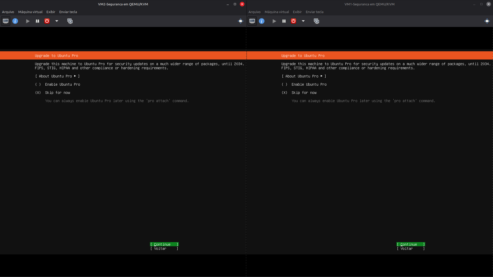

---

### 2. Instalar Ubuntu Server

instalando o sistema:
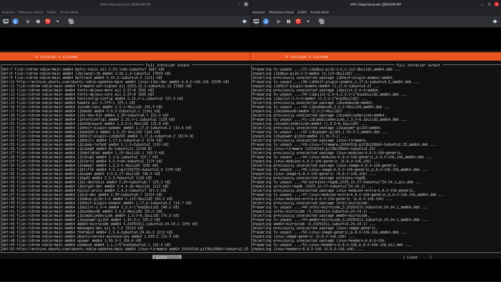
Atualizando o sistema:
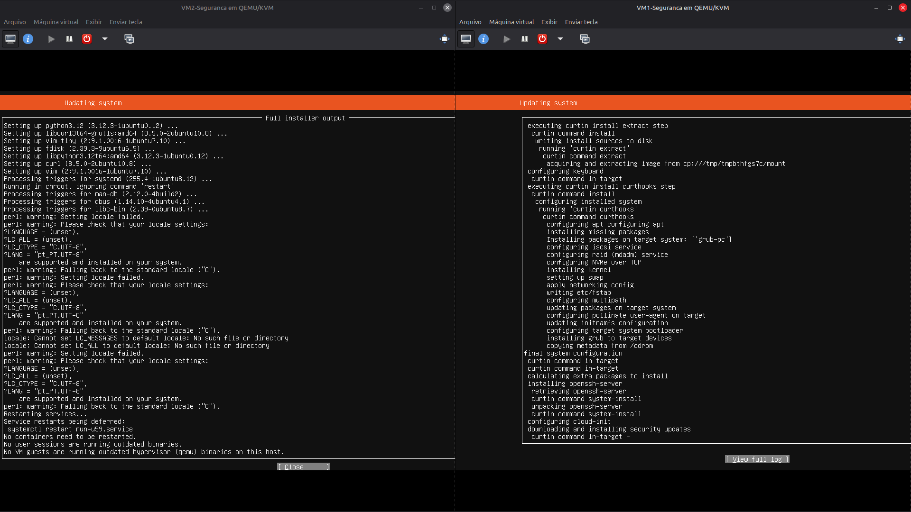
Instalação concluída:
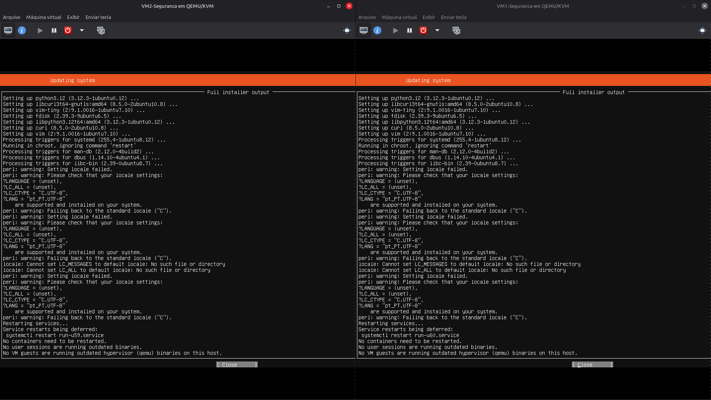

A tela aqui costuma abrir normalmente, se caso não, pode desligar a VM normalmente e então iniciala denovo para conferência.

---

### 3. Login e primeiro acesso

A partir da tela de login abaixo, optei por me conectar nas VMs com a minha própria maquina, por uma questão de layout de teclado. Isso não afeta nada, todo o passo a passo pode seguir diretamente das VMs, sem a necessidade de fazer essa conexão.

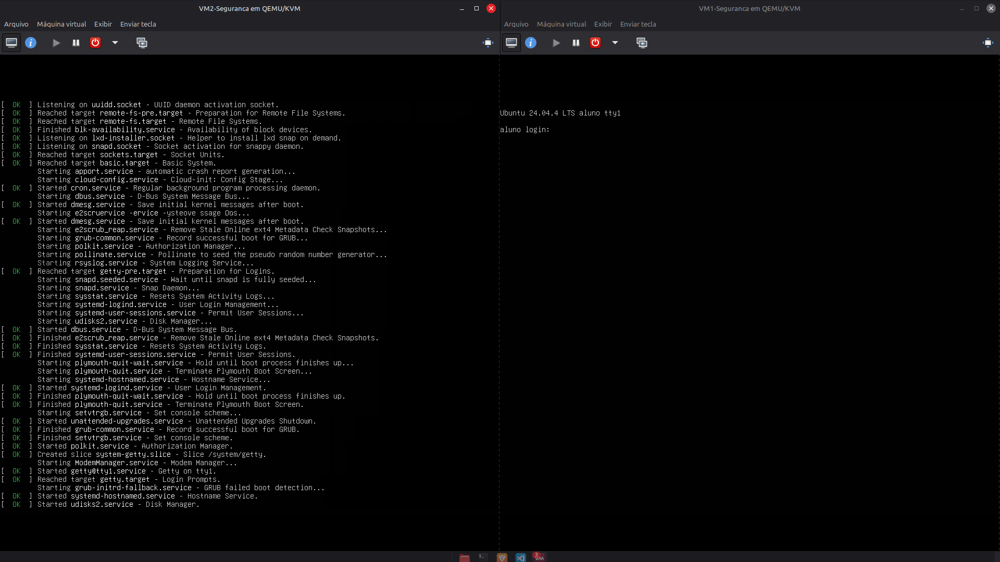
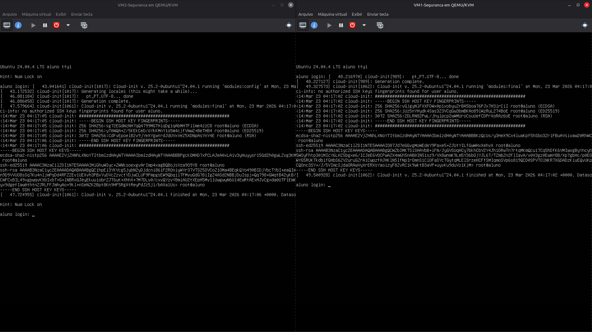

---

### 4. Conectar via SSH do host

ultilize 

```bash
ip a
```
para acessar aos IPs das VMs

```bash id="ssh1"
ssh aluno@192.168.122.242   # VM1
ssh aluno@192.168.122.241   # VM2
```

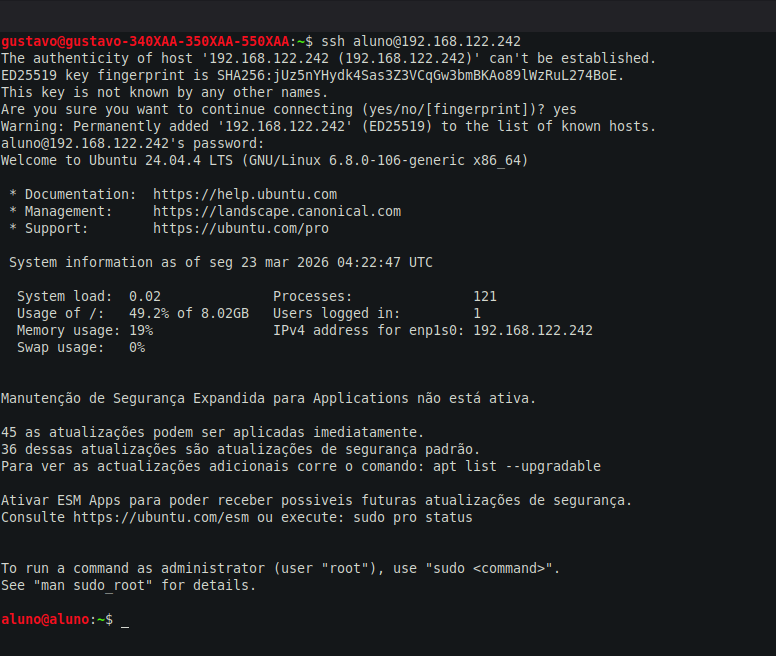

---

### 5. Criar rede interna no KVM

Desligue as VMs, aqui criaremos uma rede virtual isolada dentro do KVM/libvirt — uma “LAN privada” para as VMs se comunicarem entre si.
Aqui estou criando um arquivo chamado intranet.xml com a configuração da rede. Primeiro coloco o nome, a interface bridge (como um "switch virtual"), o endereço ip ("ip adress", que vira o caminho entre as redes, um gateway)
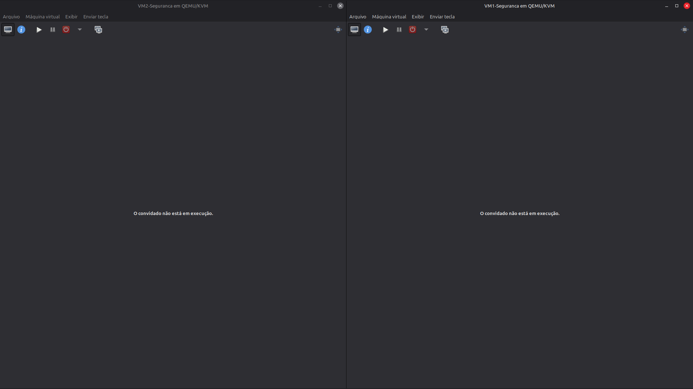
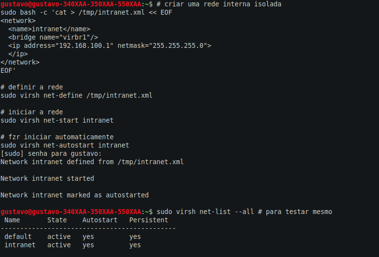
Em: 
```bash
sudo virsh net-define /tmp/intranet.xml 
```
a rede foi definida no libvirt, Network intranet defined from /tmp/intranet.xml; E com:
```bash
sudo virsh net-start intranet
```
a rede é iniciada.
---

### 6. Adicionar segunda interface


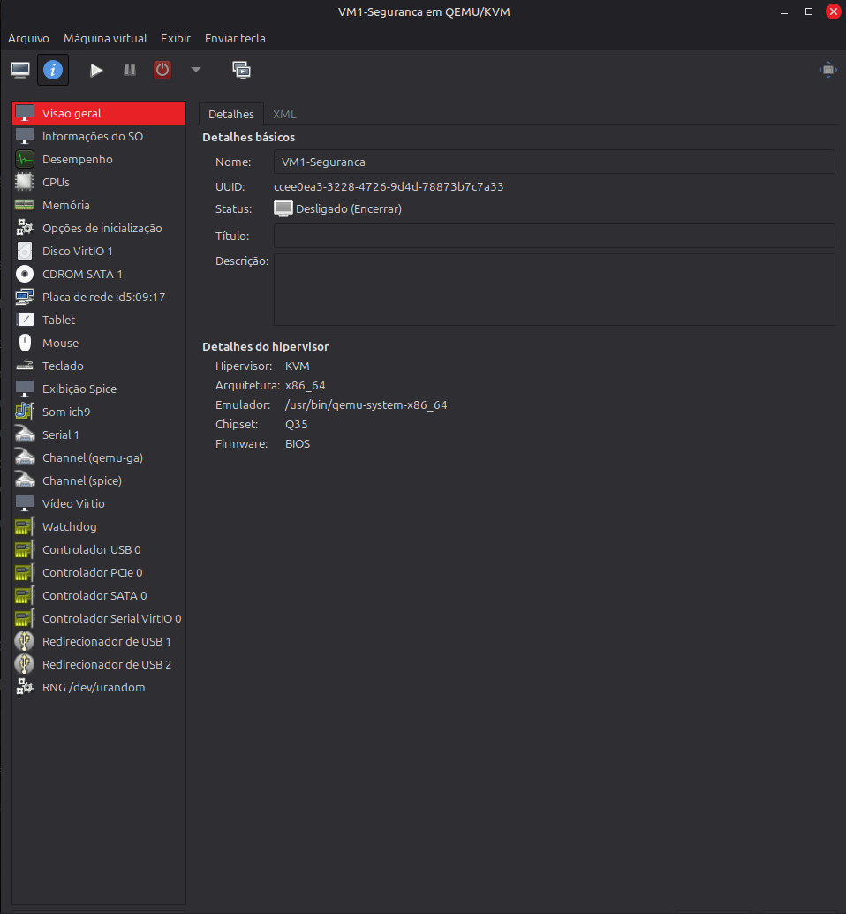

O virsh é a interface de texto para o Libvirt, que é o padrão no Linux para lidar com virtualização (KVM/QEMU).

Nessa ordem os comandos fazem: Iniciar as maquinas novamente, Conectando a rede (Como um "cabo de rede" virtual).
"Domain 'VM1-Seguranca' started" e "interface attachhed successfully" demonstram que deu certo! O mesmo vale para a VM2, cujo processo foi repetido.

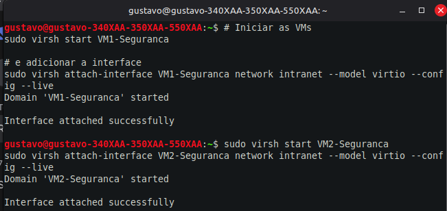

---

### 7. Conectar novamente via SSH

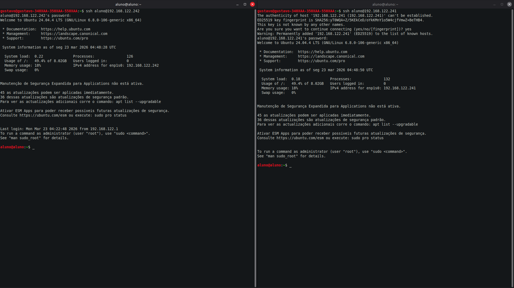

---

### 8. Configurar IPs estáticos (Netplan)

```bash id="netplan-edit"
sudo nano /etc/netplan/00-installer-config.yaml
```

Esse arquivo é o Netplan, a ferramenta padrão do Ubuntu e de outras distros Linux para configurar a rede. Aqui estou "atribuindo nomes e endereços" para as placas que acabamos de criar.

#### VM1

```yaml id="vm1"
network:
  version: 2
  ethernets:
    enp1s0:
      dhcp4: true
    enp7s0:
      dhcp4: no
      addresses:
        - 192.168.100.10/24
```

#### VM2

```yaml id="vm2"
network:
  version: 2
  ethernets:
    enp1s0:
      dhcp4: true
    enp7s0:
      dhcp4: no
      addresses:
        - 192.168.100.20/24
```

Aplicar (só salvar não funciona, esse comando faz com que as redes ativem):

```bash id="apply"
sudo netplan apply
sudo ip link set enp7s0 up
```

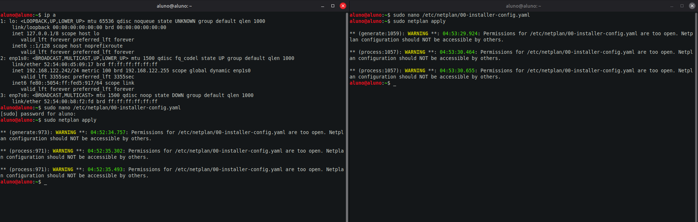

---

### 9. Testar comunicação

```bash id="ping"
ping 192.168.100.20
```

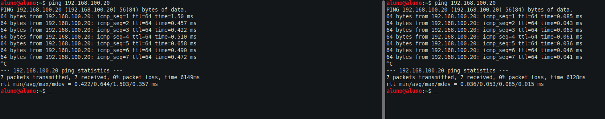

---

### 10. Firewall com iptables

Bloquear SSH:

```bash id="block"
sudo iptables -A INPUT -s 192.168.100.20 -p tcp --dport 22 -j DROP
```

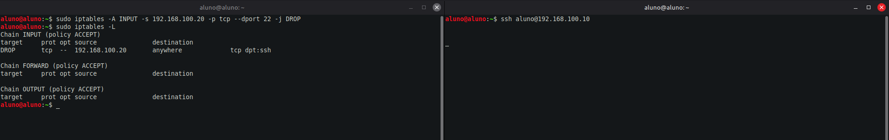

Liberar:

```bash id="unblock"
sudo iptables -D INPUT -s 192.168.100.20 -p tcp --dport 22 -j DROP
```

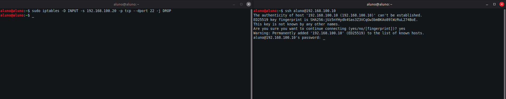

---

### 11. Escaneamento com nmap

```bash id="nmap"
sudo apt install nmap -y
nmap 192.168.100.0/24
```

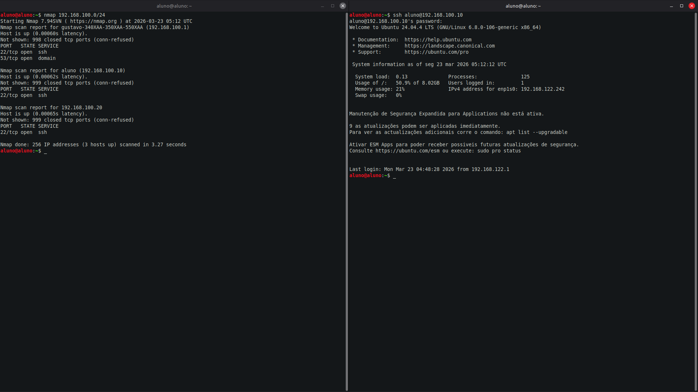

---

## Resultados

| Teste                 | Resultado |
| --------------------- | --------- |
| IPs estáticos         |  OK      |
| Comunicação entre VMs |  OK      |
| Bloqueio com iptables |  OK      |
| Liberação do SSH      |  OK      |
| Scan com nmap         |  OK      |

---


## Aprendizados

* Virtualização com KVM
* Redes internas isoladas
* Netplan
* iptables
* nmap
